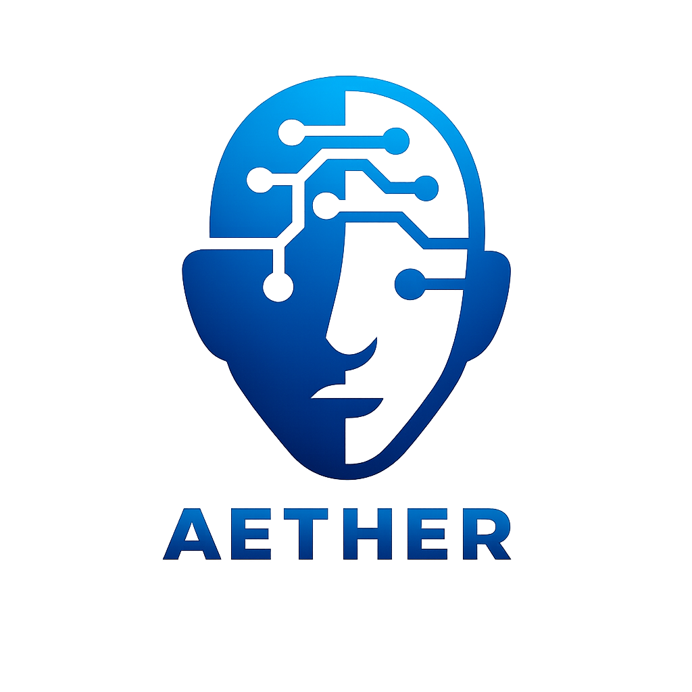
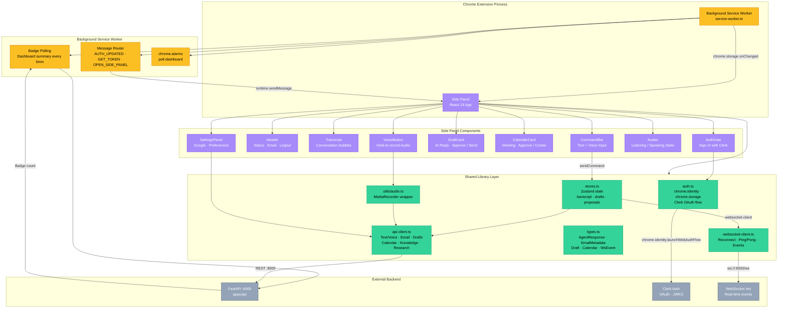
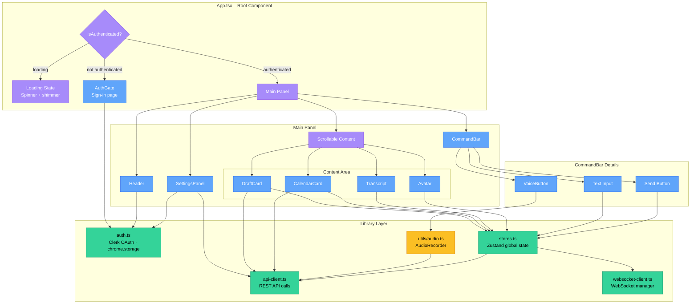
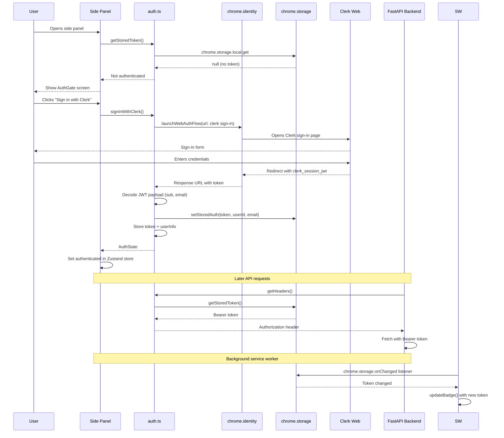
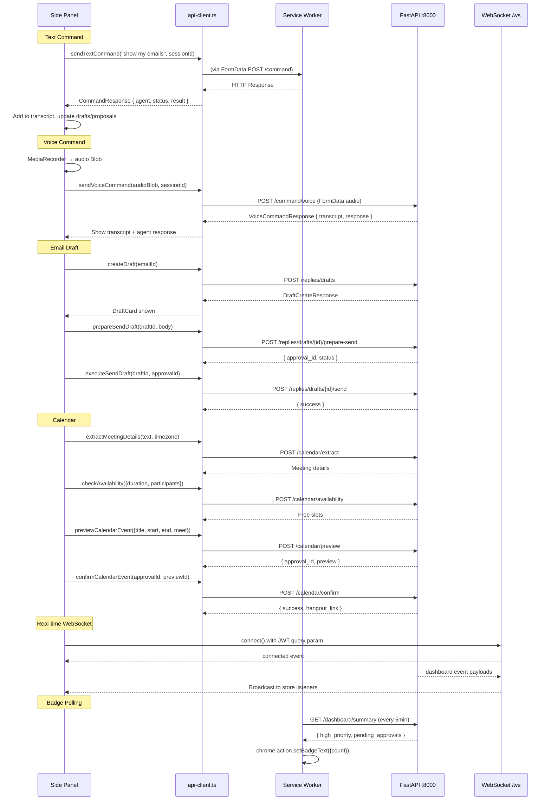
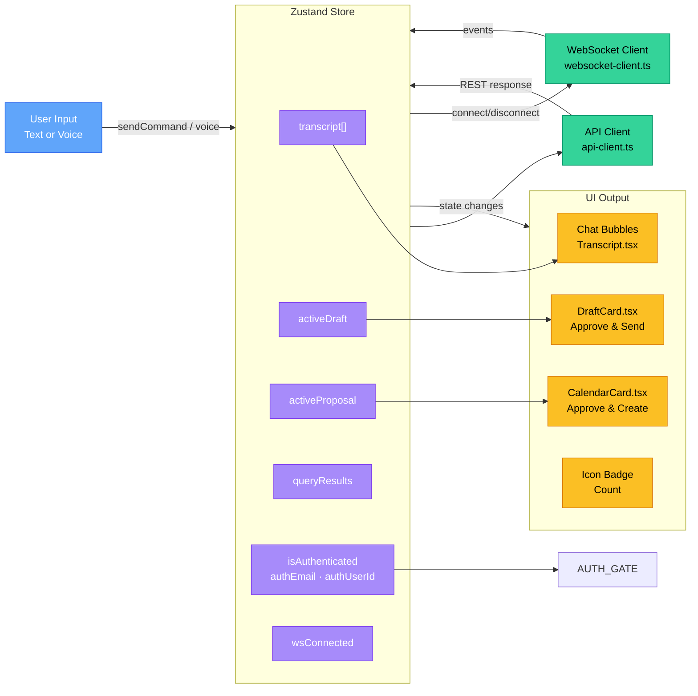

# Aether Chrome Extension — AI Chief of Staff in Your Browser

<p align="center">
  
</p>

<p align="center">
  
  
  
  
  
  
</p>

<p align="center">
  <strong>Side-panel AI assistant that puts Aether's multi-agent system in every browser tab.</strong><br/>
  Voice or text commands • Real-time inbox triage • AI reply drafting • Calendar scheduling • Market research
</p>

> **Part of the Aether monorepo.** Backend at [`apps/api`](../api/README.md). Web app at [`apps/web`](../web/README.md).

---

## Features

| Capability | Description |
|---|---|
| **Side Panel UI** | Persistent AI assistant accessible from any tab via toolbar icon |
| **Voice Commands** | Hold-to-record via Web Speech API + MediaRecorder, ElevenLabs STT |
| **Text Commands** | Type natural language commands routed through the Supervisor Agent |
| **AI Reply Drafts** | Inline draft cards with approve-and-send flow through the Approval Gate |
| **Calendar Proposals** | Meeting preview cards with approve-and-create confirmation |
| **Real-Time Updates** | WebSocket connection for live dashboard events and notifications |
| **Badge Notifications** | Icon badge shows high-priority + pending approvals count (polls every 5min) |
| **Google Integration** | Connect/disconnect Google Workspace from Settings panel |
| **Conversation History** | Persistent transcript with typing indicators and agent labels |
| **Cross-Device Sessions** | Independent session context per device, shared user data via Clerk |

---

## Why a Chrome Extension?

Aether's primary interface is the **side panel** — always available, always in view, without leaving your current tab. Unlike the web app which requires navigating to a dashboard, the extension is:

- **Context-preserving** — open it in any Gmail tab, LinkedIn profile, or docs page
- **Zero context-switch** — command Aether without losing your place
- **Lightweight** — ~200KB built bundle, minimal memory footprint
- **Same backend** — zero API changes needed; uses the same Clerk JWT auth and endpoints

---

## Architecture Overview



---

## Folder Structure

```
apps/extension/
├── public/
│   ├── manifest.json              # Chrome Extension Manifest V3
│   └── icons/
│       ├── icon-16.png
│       ├── icon-48.png
│       └── icon-128.png
│
├── src/
│   ├── background/
│   │   └── service-worker.ts      # Background SW: badge polling, message routing, alarms
│   │
│   ├── sidepanel/
│   │   ├── index.html             # Entry HTML
│   │   ├── main.tsx               # React root mount
│   │   ├── App.tsx                # Root component: auth gate, layout, routing
│   │   ├── styles/
│   │   │   └── globals.css        # Tailwind 4 + custom animations
│   │   └── components/
│   │       ├── AuthGate.tsx        # Clerk OAuth sign-in via chrome.identity
│   │       ├── Avatar.tsx          # Animated voice/listening state indicator
│   │       ├── Header.tsx          # Top bar: logo, status, email, settings, logout
│   │       ├── Transcript.tsx      # Chat bubble conversation history
│   │       ├── CommandBar.tsx      # Text input + voice button + send
│   │       ├── VoiceButton.tsx     # Hold-to-record mic button
│   │       ├── DraftCard.tsx       # AI reply draft with approve/send flow
│   │       ├── CalendarCard.tsx    # Calendar proposal with approve/create flow
│   │       └── SettingsPanel.tsx   # Full-screen settings: Google, preferences, account
│   │
│   ├── lib/
│   │   ├── auth.ts                # Clerk OAuth + chrome.storage token management
│   │   ├── api-client.ts          # Full API client (command, inbox, drafts, calendar, etc.)
│   │   ├── stores.ts              # Zustand store (transcript, auth, drafts, proposals)
│   │   ├── types.ts               # TypeScript interfaces (236 lines)
│   │   └── websocket-client.ts    # WebSocket with reconnect, events, ping/pong
│   │
│   ├── utils/
│   │   └── audio.ts               # MediaRecorder wrapper for voice capture
│   │
│   └── vite-env.d.ts
│
├── .env.example                   # Environment variables template
├── vite.config.ts                 # Vite build config (React + Tailwind + multi-entry)
├── tsconfig.json                  # TypeScript config (ESNext, DOM, Chrome types)
├── tsconfig.node.json             # Node TypeScript config for Vite
└── package.json                   # Dependencies: React, Tailwind, Zustand, Lucide
```

---

## Component Architecture



---

## Authentication Flow

The extension uses **Clerk OAuth 2.0** via `chrome.identity.launchWebAuthFlow` — the standard Chrome extension auth pattern:



### Session Storage

- **Token** — stored in `chrome.storage.local` under `clerk_session_token`
- **User info** — stored under `clerk_user_info` (userId + email)
- **Cross-component sync** — `chrome.storage.onChanged` listener in service worker keeps badge in sync
- **Message passing** — `runtime.sendMessage` with `GET_TOKEN` for on-demand token requests

---

## API Communication

The extension communicates with the backend through the same REST + WebSocket interfaces as the web app:



---

## Data Flow



---

## Background Service Worker

The service worker (`src/background/service-worker.ts`) runs persistently in the background with three responsibilities:

### 1. Badge Polling
- Creates `chrome.alarms` named `poll-dashboard` on install (every 5 minutes)
- Fetches `GET /dashboard/summary` with the stored Bearer token
- Sets `chrome.action.setBadgeText` to `high_priority + pending_approvals`
- Sets badge color to red (>0) or green (0)

### 2. Token Synchronisation
- Listens to `chrome.storage.onChanged` for `clerk_session_token` changes
- Updates the in-memory `currentToken` variable and refreshes badge

### 3. Message Router
- `AUTH_UPDATED` — receives updated token from side panel
- `GET_TOKEN` — returns current token to any caller
- `OPEN_SIDE_PANEL` — programmatically opens the side panel for a tab

### 4. Panel Behaviour
- `chrome.sidePanel.setPanelBehavior({ openPanelOnActionClick: true })` — opens side panel when toolbar icon is clicked

---

## Side Panel Components

### AuthGate
Full-screen sign-in page with gradient background, animated logo, and "Sign in with Clerk" button. Uses `chrome.identity.launchWebAuthFlow` to open Clerk's sign-in page as a popup, decodes the returned JWT, stores credentials via `chrome.storage.local`, and updates the Zustand store.

### Header
Top bar showing:
- Aether logo + name
- WebSocket connection status indicator (Live/Offline green dot)
- User email (truncated)
- Settings gear button → opens SettingsPanel
- Logout button → clears stored auth + resets Zustand store

### Transcript
Chat bubble list of `TranscriptEntry` items. Each bubble shows:
- **User messages** — right-aligned, primary background
- **Assistant messages** — left-aligned, card background with "Aether" label and agent name badge
- **Loading indicator** — animated typing dots while command is processing
- **Auto-scroll** — `useEffect` scrolls to bottom on new entries
- **Empty state** — "Type a command to get started" placeholder

### CommandBar
Bottom input bar with:
- **VoiceButton** — hold-to-record mic; red glow while recording
- **Text input** — placeholder "Type a command...", Enter to send
- **Send button** — primary colour, shows spinner during loading

### VoiceButton
Push-to-talk voice input:
- `onMouseDown` — starts `AudioRecorder` (MediaRecorder with Opus codec)
- `onMouseUp` — stops recording, sends blob via `sendVoiceCommand`, adds user + assistant entries to transcript
- Visual feedback: red gradient background + scale animation when recording
- Pulse ring animation during recording

### DraftCard
Inline AI reply draft card with:
- "AI Reply Draft" label + "Awaiting Approval" badge
- Recipient display
- **Knowledge Gap** section (if draft has gaps) — amber warning with gap notes
- Draft body in scrollable text area
- "Approve & Send" button → `prepareSendDraft` → `executeSendDraft` flow
- "Discard" X button

### CalendarCard
Calendar proposal card with:
- "Calendar Proposal" label + "Awaiting Approval" badge
- Title, time, attendees display
- Google Meet link (if generated)
- "Approve & Create" button → `confirmCalendarEvent`
- "Discard" X button

### SettingsPanel
Full-screen slide-up panel with:
- **Google Integration** section — status indicator, connect/disconnect button
- **Preferences** section — timezone input, language input, voice history toggle, save button
- **Account** section — User ID display

### Avatar
Animated circular avatar showing Aether's state:
- **Idle** — static gradient sphere
- **Listening** — pulsing animation
- **Speaking** — intense glow pulse + shadow

---

## Audio Recording

The `AudioRecorder` utility (`utils/audio.ts`) wraps the Web API `MediaRecorder`:

| Property | Value |
|---|---|
| Sample rate | 48,000 Hz |
| Channels | 1 (mono) |
| Echo cancellation | Enabled |
| Noise suppression | Enabled |
| Codec | `audio/webm;codecs=opus` (fallback: `audio/webm`) |
| Chunk interval | 250ms |
| Output | `Blob` (full recording) |

---

## WebSocket Client

The `WebSocketClient` class (`lib/websocket-client.ts`) provides:

| Feature | Implementation |
|---|---|
| Connection | `ws://{host}/ws?token={JWT}` |
| Token auth | Reads from `chrome.storage.local` at connect time |
| Event system | Typed `on()` / `off()` with `WsEvent` union |
| Wildcard events | `*` listener receives all events |
| Reconnection | Exponential backoff: 1s → 2s → 4s → 8s → 16s (max 5 attempts) |
| Ping/Pong | `sendPing()` method for keepalive |
| Cleanup | `disconnect()` sets `shouldReconnect = false` and closes socket |

### Event Types

| Event | Description |
|---|---|
| `connected` | WebSocket established, `{ user_id, message }` |
| `pong` | Keepalive response |
| `new_email` | New email indexed and classified |
| `draft_created` | AI draft generated |
| `approval_needed` | New approval request created |
| `meeting_proposal` | Calendar proposal created |
| `research_completed` | Market research finished |

---

## Zustand Store

The store (`lib/stores.ts`) manages all extension state:

```
ExtensionState {
  isAuthenticated: boolean
  authEmail: string | null
  authUserId: string | null
  isAuthLoading: boolean
  sessionId: string              // persistent UUID in localStorage
  transcript: TranscriptEntry[]  // full conversation history
  isCommandLoading: boolean
  activeDraft: ActiveDraft | null
  activeProposal: ActiveCalendarProposal | null
  queryResults: EmailMetadata[]
  isListening: boolean
  isSpeaking: boolean
  wsConnected: boolean
  unreadCount: number
}
```

Key actions: `initAuth`, `setAuthenticated`, `logout`, `sendCommand`, `clearTranscript`, `setActiveDraft`, `setActiveProposal`

The `sendCommand` action:
1. Creates a user `TranscriptEntry`
2. Calls `sendTextCommand(text, sessionId)`
3. Parses the `AgentResponse` for drafts, proposals, search results
4. Updates `activeDraft`, `activeProposal`, `queryResults` based on response
5. Creates an assistant `TranscriptEntry` with agent name + content

---

## API Client

The API client (`lib/api-client.ts`) mirrors the backend routes at `apps/api`. All 23 exported functions:

### Command
| Function | Method | Endpoint |
|---|---|---|
| `sendTextCommand` | POST FormData | `/command` |
| `sendVoiceCommand` | POST FormData | `/command/voice` |

### Inbox
| Function | Method | Endpoint |
|---|---|---|
| `getEmails` | GET | `/inbox/emails` |
| `searchEmails` | GET | `/inbox/search` |
| `getRecentEmails` | GET | `/inbox/recent` |
| `syncRecentEmails` | GET | `/inbox/recent` |

### Replies
| Function | Method | Endpoint |
|---|---|---|
| `createDraft` | POST | `/replies/drafts` |
| `listDrafts` | GET | `/replies/drafts` |
| `editDraft` | POST | `/replies/drafts/{id}/edit` |
| `prepareSendDraft` | POST | `/replies/drafts/{id}/prepare-send` |
| `executeSendDraft` | POST | `/replies/drafts/{id}/send` |
| `discardDraft` | DELETE | `/replies/drafts/{id}` |

### Calendar
| Function | Method | Endpoint |
|---|---|---|
| `extractMeetingDetails` | POST | `/calendar/extract` |
| `checkAvailability` | POST | `/calendar/availability` |
| `previewCalendarEvent` | POST | `/calendar/preview` |
| `confirmCalendarEvent` | POST | `/calendar/confirm` |

### Dashboard & Integrations
| Function | Method | Endpoint |
|---|---|---|
| `getDashboardSummary` | GET | `/dashboard/summary` |
| `getGoogleIntegrationStatus` | GET | `/integrations/google/status` |
| `connectGoogle` | GET | `/integrations/google/connect` |
| `disconnectGoogle` | DELETE | `/integrations/google` |

### Knowledge, Settings, Research
| Function | Method | Endpoint |
|---|---|---|
| `listKnowledgeDocuments` | GET | `/knowledge/documents` |
| `queryKnowledge` | POST FormData | `/knowledge/query` |
| `getUserProfile` | GET | `/settings/profile` |
| `updateUserProfile` | PUT | `/settings/profile` |
| `getUserPreferences` | GET | `/settings/preferences` |
| `updateUserPreferences` | PUT FormData | `/settings/preferences` |
| `runResearch` | POST FormData | `/research/run` |
| `listPlaybooks` | GET | `/playbooks` |
| `listVipContacts` | GET | `/vip-contacts` |

### Auth Headers

Every API call uses `getHeaders()` or `getFormHeaders()` which:
1. Reads `clerk_session_token` from `chrome.storage.local`
2. Returns `{ Authorization: Bearer <token>, Content-Type: application/json }` (or FormData headers for uploads)

---

## Design System

### Colours

| Token | Value | Usage |
|---|---|---|
| `--color-background` | `#0a0a0f` | Side panel background |
| `--color-foreground` | `#ededef` | Primary text |
| `--color-primary` | `#6366f1` | CTA, links, active states |
| `--color-accent` | `#10b981` | Success, calendar approve |
| `--color-destructive` | `#ef4444` | Voice recording, errors |
| `--color-muted` | `#1f1f23` | Subtle surfaces, scrollbar |
| `--color-card` | `#0e0e12` | Card backgrounds |
| `--color-border` | `#27272a` | Borders, inputs |

### Animations

| Name | Duration | Usage |
|---|---|---|
| `fade-in` | 0.25s | Transcript bubbles, cards |
| `fade-in-up` | 0.3s | Draft/calendar cards |
| `slide-up` | 0.25s | Settings panel |
| `pulse-ring` | 1.5s | Voice recording indicator |
| `pulse-glow` | 2s | Avatar, loading logo |
| `dot-pulse` | 1.4s | Typing indicator dots |
| `shimmer` | 1.5s | Loading skeleton |

---

## Environment Variables

| Variable | Required | Default | Description |
|---|---|---|---|
| `VITE_API_URL` | No | `http://localhost:8000` | Backend API base URL |
| `VITE_WS_URL` | No | `ws://localhost:8000/ws` | WebSocket server URL |
| `VITE_CLERK_FRONTEND_API` | Yes | — | Clerk Frontend API domain (e.g., `your-app.clerk.accounts.dev`) |

> Copy `.env.example` to `.env` and set `VITE_CLERK_FRONTEND_API`. The extension will not build without it.

---

## Installation & Development

### Prerequisites

- Node.js 20+
- pnpm 9+
- Chrome 120+ (for Manifest V3)
- Clerk application with OAuth configured
- Backend running at `http://localhost:8000`

### Setup

```bash
# From monorepo root
cd apps/extension

# Copy environment template
cp .env.example .env

# Edit .env with your Clerk Frontend API domain
# VITE_CLERK_FRONTEND_API=your-app.clerk.accounts.dev

# Install dependencies
pnpm install
```

### Development

```bash
# Start Vite dev server with HMR
pnpm dev

# Watch for changes and rebuild
```

### Build

```bash
# Production build
pnpm build

# Output: dist/
#   dist/background.js       — Service worker
#   dist/sidepanel/index.html — Side panel
```

### Load in Chrome

1. Open `chrome://extensions`
2. Enable **Developer mode**
3. Click **Load unpacked**
4. Select `apps/extension/dist/`
5. Pin the extension to your toolbar
6. Click the icon to open the side panel

---

## Available Scripts

| Script | Description |
|---|---|
| `pnpm dev` | Start Vite dev server with HMR |
| `pnpm build` | Type-check + Vite production build |
| `pnpm preview` | Preview production build |
| `pnpm lint` | TypeScript type-check (`tsc --noEmit`) |

---

## Manifest

The extension uses **Manifest V3**:

```json
{
  "manifest_version": 3,
  "name": "Aether — AI Email Assistant",
  "permissions": ["storage", "sidePanel", "alarms", "identity"],
  "host_permissions": [
    "http://localhost:8000/*",
    "https://*.clerk.accounts.dev/*",
    "https://api.clerk.com/*"
  ],
  "side_panel": { "default_path": "src/sidepanel/index.html" },
  "background": {
    "service_worker": "background.js",
    "type": "module"
  },
  "action": {
    "default_title": "Aether — Open Assistant",
    "default_icon": { "16": "icons/icon-16.png", "48": "icons/icon-48.png", "128": "icons/icon-128.png" }
  }
}
```

---

## Security

| Layer | Implementation |
|---|---|
| **Authentication** | Clerk OAuth 2.0 via `chrome.identity.launchWebAuthFlow` |
| **Token Storage** | `chrome.storage.local` (isolated per extension, not accessible by other extensions) |
| **API Auth** | Bearer token in `Authorization` header for every request |
| **WebSocket Auth** | JWT passed as query parameter (`?token=`) on connect |
| **Host Permissions** | Only `localhost:8000`, `clerk.accounts.dev`, `api.clerk.com` |
| **Permissions** | Minimal: `storage`, `sidePanel`, `alarms`, `identity` — no `tabs`, `cookies`, `webRequest` |

---

## Error Handling

| Scenario | Behaviour |
|---|---|
| **Auth fails** | `AuthGate` shows error message with retry |
| **API error** | `sendCommand` catches and adds error entry to transcript (red/destructive styling) |
| **Network offline** | WebSocket shows "Offline" badge, reconnects with exponential backoff |
| **Voice permission denied** | `AudioRecorder.startRecording()` throws, caught by `VoiceButton` |
| **Send fails** | `DraftCard` shows `alert()` with error message |
| **Token expired** | Service worker fails badge poll silently, side panel continues with stored token until next command |

---

## Testing

Tests are not yet configured. The extension is ready for:

```bash
# Future test commands:
pnpm test              # Unit tests (Vitest)
pnpm test:e2e          # E2E tests (Puppeteer / Playwright with chrome headless)
```

---

## Browser Support

| Browser | Status |
|---|---|
| Google Chrome 120+ | ✅ Full support (Manifest V3) |
| Microsoft Edge 120+ | ✅ Load unpacked via `edge://extensions` |
| Brave 1.60+ | ✅ Load unpacked via `brave://extensions` |
| Firefox | 🔄 Planned (Manifest V2 variant) |

---

## Cross-Device Sessions

The extension maintains **independent session contexts** from the web app:
- `sessionId` is generated per device via `crypto.randomUUID()`, stored in `localStorage`
- User data is shared via Clerk's cloud-synced session
- Each device has its own conversation history, active drafts, and proposals
- The backend keys context by `(clerk_user_id, session_id)` — no collision

---

## Contributing

1. Create a feature branch: `git checkout -b feature/amazing-feature`
2. Make changes following existing code patterns
3. Run `pnpm lint` (TypeScript check)
4. Build: `pnpm build`
5. Load unpacked in Chrome to test
6. Open a Pull Request

### Code Conventions

- **Build tool:** Vite 6 with React + Tailwind plugins
- **State:** Zustand (single store in `lib/stores.ts`)
- **API client:** One function per endpoint, typed responses, `getHeaders()` for auth
- **Components:** Named exports in `sidepanel/components/`
- **Styling:** Tailwind CSS 4 with custom `@theme` tokens in `globals.css`
- **Auth flows:** Always use `chrome.identity.launchWebAuthFlow`, never popup windows

---

## License

This project is part of the Aether monorepo. See the root LICENSE file for details.

---

<p align="center">
  <strong>Aether Chrome Extension</strong> — Your inbox, autonomously refined.<br/>
  <sub>Built with React, Vite, Tailwind CSS, Zustand, and Clerk</sub>
</p>
